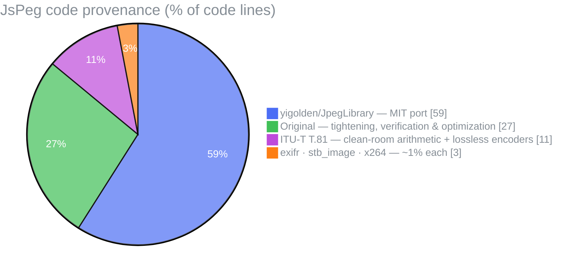

# Architecture

JsPeg is a pure-JavaScript (ESM), zero-dependency port of the C# library
[yigolden/JpegLibrary](https://github.com/yigolden/JpegLibrary) (MIT), with the
inverse DCT from [stb_image](https://github.com/nothings/stb) (public domain) and
the EXIF-orientation reader adapted from [exifr](https://github.com/MikeKovarik/exifr)
(MIT). It runs identically in Node and the browser.

## Code provenance

Roughly where the ~7.4k lines come from (by code line, blanks/comments excluded —
the split is approximate, since a few files mix ported and original code):



The **port** is the decoders, the baseline encoder and the optimizer core. The
**original** slice is the convenience API, the clean-room utilities (fancy
upsampling, ICC, EXIF/XMP/IPTC metadata, marker scanning, the exact forward DCT),
the extra `optimize()` modes, the robustness work (DNL, precision validation), and
the entire test suite. **T.81** covers the spec-derived encoders (QM-coder
arithmetic, lossless SOF3, progressive). Everything is single-license MIT — see
the [README notes](../README.md#notes).

The numbers are **percentages** of code lines. The three sub-1% donors (exifr,
stb_image, x264) are merged into a single slice so their labels don't overlap.
Slice colours are complementary hues (shade 6) from the [Open Color](https://yeun.github.io/open-color/)
palette, one per colour family for contrast: `pie1` indigo `#4c6ef5`, `pie2` green
`#40c057`, `pie3` grape `#be4bdb`, `pie4` orange `#fd7e14`. The title and legend use
gray-6 `#868e96`, a mid-tone that stays legible on both light and dark GitHub themes.

## Public API (`src/index.js`)

| Function | Does |
|---|---|
| `decode(bytes, opts?)` | JPEG → `{ width, height, data }` (RGBA `Uint8ClampedArray`) |
| `decodeComponents(bytes)` | JPEG → raw component planes + `.metadata` (EXIF/XMP/IPTC) + `.icc`, no colour conversion |
| `encode({ width, height, data }, opts?)` | RGBA → JPEG bytes — baseline, **progressive** / **arithmetic** (`{ progressive }` / `{ arithmetic }`), or lossless SOF3 (`{ lossless }`) |
| `optimize(bytes, opts?)` | JPEG → smaller JPEG, pixels unchanged (see [OPTIMIZATION.md](OPTIMIZATION.md)) |

The class-level API (`JpegDecoder`, `JpegEncoder`, `JpegOptimizer`, the table and
writer types) is exported too, for custom pipelines.

## The three pipelines

**Decode** — `decode()`
```
bytes → JpegReader (marker scan) → JpegDecoder (dispatch DQT/DHT/DAC/DRI/SOFn/SOS/APPn)
      → createScanDecoder(SOFn) → ScanDecoder:
            entropy-decode coefficients → dequantize + un-zig-zag → inverse DCT
            → level shift → JpegBlockOutputWriter (full-resolution component planes)
      → fancy bilinear chroma upsampling (upsample.js) → colorConverter (YCbCr / CMYK / YCCK → RGB) → RGBA
      → EXIF orientation applied (exif.js), unless { applyOrientation: false }
```

**Encode** — `encode()`
```
RGBA → JpegBufferInputReader → colorConverter (RGB → YCbCr) + subsample
     → forward DCT (exact DCT-II) → quantize → Huffman encode → JpegWriter → bytes
```
`{ progressive }` / `{ arithmetic }` encode a baseline and then transcode it
(losslessly, via `optimize()`) to SOF2 / SOF9 / SOF10 — the coefficients are
identical, so the result matches a direct progressive/arithmetic encode.

`{ lossless }` takes a separate path (`JpegLosslessEncoder`): no DCT or quantization —
spatial prediction (T.81's 7 predictors, 2–16-bit) + Huffman of residuals, for an exact round-trip.

**Optimize** — `optimize()` (a pure *entropy transcode*, no pixel math)
```
pass 1 (scan):     Huffman-decode symbols only → tally frequencies → build optimal tables
pass 2 (optimize): re-emit the same coefficients with the new tables; copy/strip other segments
```

The other `optimize()` modes instead extract the quantized coefficients into a
`JpegBlockAllocator` and re-emit them in a different layout (all but trellis remain
lossless):

- `{ progressive }` → **progressive** scans via
  `ScanEncoder/JpegHuffmanProgressiveScanEncoder` (the inverse of the progressive
  decoder) — renders incrementally.
- `{ arithmetic }` → **arithmetic** SOF9 via `ScanEncoder/JpegArithmeticScanEncoder`
  (a clean-room QM-coder, the dual of `decodeBinaryDecision`) +
  `JpegArithmeticSequentialScanEncoder`.
- `{ arithmetic, progressive }` → **arithmetic progressive** SOF10 via
  `JpegArithmeticProgressiveScanEncoder` (the QM-coder + successive approximation).
- `{ trellis }` → **lossy** R-D coefficient thresholding (`JpegTrellis.js`), then a
  re-encoded baseline.

## Scan decoders (`src/ScanDecoder/`)

`createScanDecoder(sofMarker)` dispatches by frame type; every decoder exposes the
same `processScan(reader, scanHeader)` / `dispose()` lifecycle:

| Frame | Marker | Decoder |
|---|---|---|
| Baseline / extended sequential | SOF0 / SOF1 | `JpegHuffmanBaselineScanDecoder` |
| Progressive | SOF2 | `JpegHuffmanProgressiveScanDecoder` |
| Lossless | SOF3 | `JpegHuffmanLosslessScanDecoder` |
| Arithmetic sequential | SOF9 | `JpegArithmeticSequentialScanDecoder` |
| Arithmetic progressive | SOF10 | `JpegArithmeticProgressiveScanDecoder` |

- **Shared helpers** live in `common.js` (`initDecodeComponents`,
  `dequantizeBlockAndUnZigZag`, `shiftDataLevel`, `finalizeProgressiveBlocks`).
- **Progressive** (Huffman and arithmetic) accumulate coefficients in a
  `JpegBlockAllocator` across multiple scans, then run the shared
  `finalizeProgressiveBlocks` (dequant → IDCT → level-shift → flush) on `dispose()`.
- **Arithmetic** decoders share a QM-coder base, `JpegArithmeticScanDecoder` — the
  binary arithmetic decoder (ITU-T T.81 Annex D), the 114-entry Qe state table, and
  per-context statistics bins.

## Module map (`src/`)

| Area | Modules |
|---|---|
| Entry / API | `index.js` |
| Stream parsing | `JpegReader`, `JpegBitReader`, `JpegMarker`, `markerScan` |
| Headers & tables | `JpegFrameHeader`, `JpegScanHeader`, `JpegQuantizationTable`, `JpegStandardQuantizationTable`, `JpegHuffmanDecodingTable`, `JpegArithmeticDecodingTable`, `JpegArithmeticStatistics`, `JpegElementPrecision`, `JpegZigZag` |
| Math / transforms | `JpegMathHelper`, `dct` (stb IDCT + exact FDCT), `colorConverter`, `upsample` (fancy bilinear chroma) |
| Decode | `JpegDecoder` + `ScanDecoder/*`; metadata via `icc` / `exif` / `metadata` (EXIF·XMP·IPTC·thumbnail); colour via `colorConverter` |
| Block buffers / output | `JpegBlockAllocator`, `JpegBlockOutputWriter`, `output/JpegBufferOutputWriter`, `JpegPartialScanlineAllocator` |
| Encode | `JpegEncoder`, `JpegLosslessEncoder`, `JpegWriter`, `JpegHuffmanEncoding*`, `JpegStandardHuffmanEncodingTable`, `JpegBlockInputReader`, `input/JpegBufferInputReader` |
| Optimize | `JpegOptimizer`, `JpegTrellis`, `ScanEncoder/*` (progressive + arithmetic encoders) |
| EXIF | `exif` |

## Number representation

- **Coefficients**: `Int16Array` (one 64-entry block at a time, or a full
  `JpegBlockAllocator` buffer for progressive).
- **DCT scratch**: `Float32Array`.
- **Output**: `Uint8ClampedArray` (RGBA, canvas-ready).
- The entropy reader emulates a 64-bit bit register with a single JS `Number` and
  power-of-two masking; the QM-coder mirrors C#'s `int` (32-bit signed) math via the `| 0` idiom.

See [TESTS.md](TESTS.md) for how each path is validated, and
[OPTIMIZATION.md](OPTIMIZATION.md) for the optimizer.
